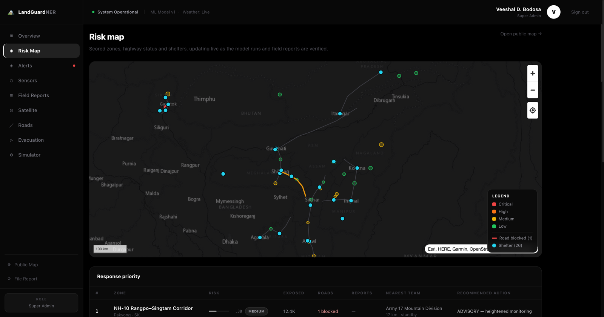
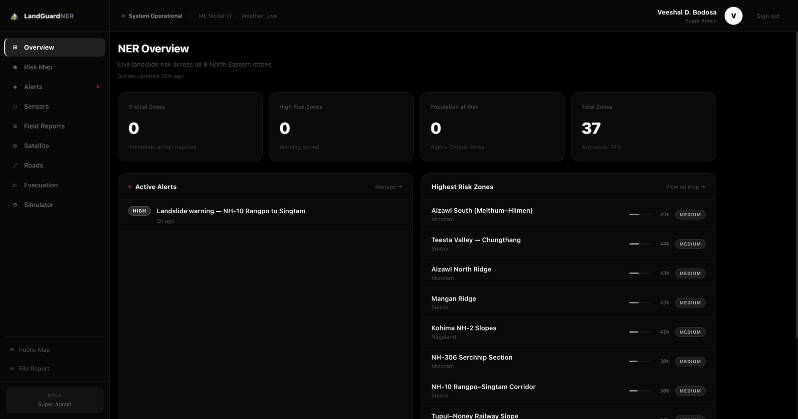
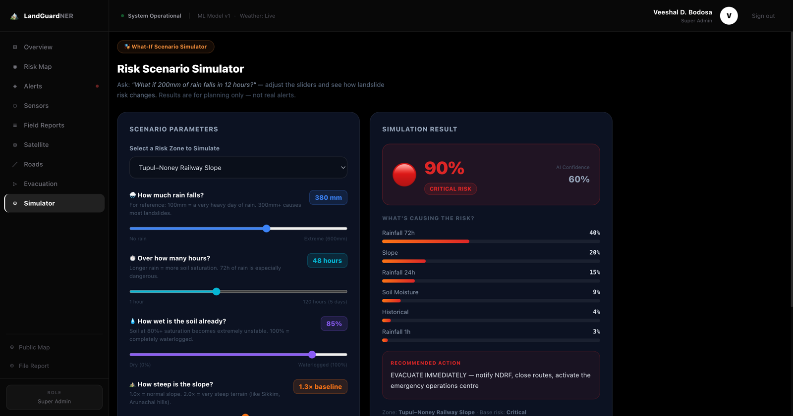
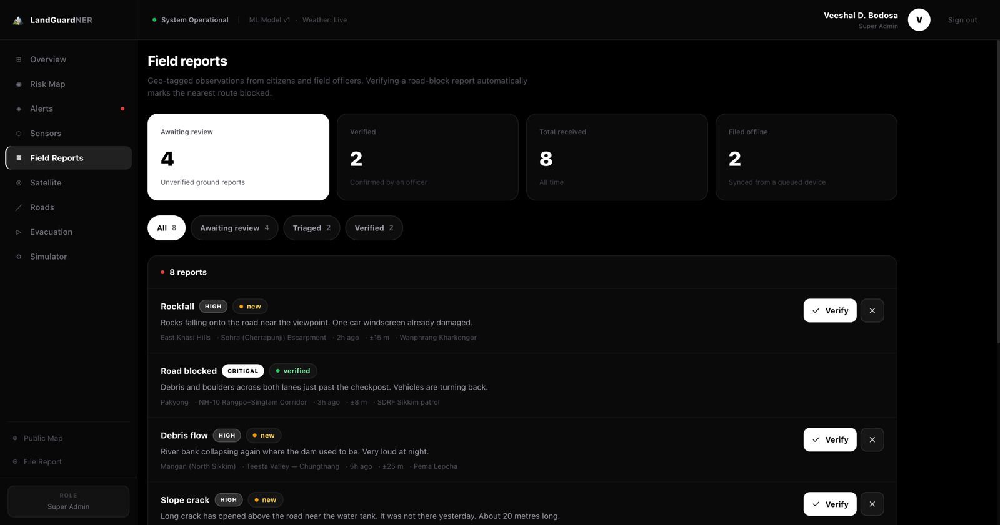
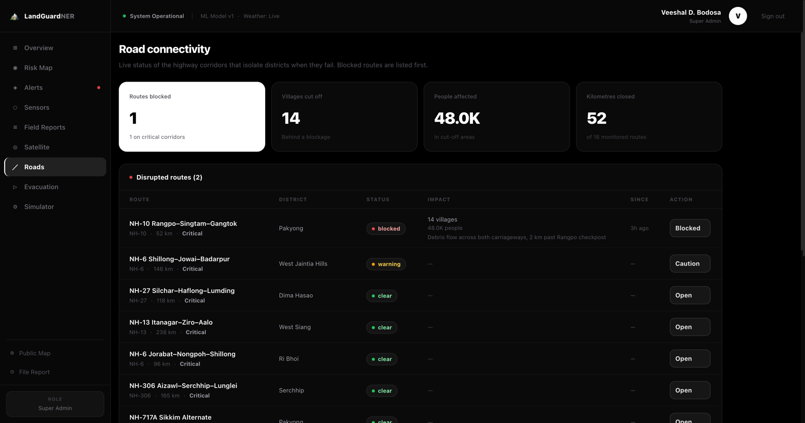
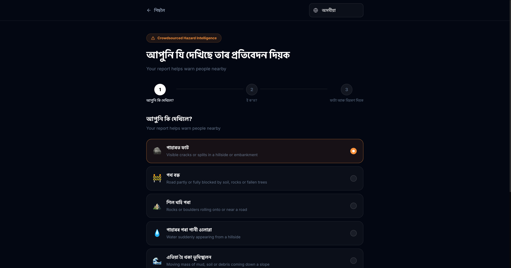

<div align="center">


# LandGuard NER

### AI-based landslide early warning and risk monitoring for North East India

<p>
  <a href="#"></a>
  <a href="#"></a>
  <a href="#"></a>
  <a href="#"></a>
  <a href="#"></a>
</p>

<p><strong>Smart India Hackathon 2026 · Problem Statement 26001</strong><br/>
Ministry of Development of North Eastern Region (MDoNER)</p>

<p>
  <code>50 districts</code> ·
  <code>37 landslide corridors</code> ·
  <code>134 sensors</code> ·
  <code>8 languages</code> ·
  <code>1.8 crore people covered</code>
</p>

</div>

---

## The problem

The North East loses roads, rail links and lives to landslides every monsoon. Haflong
station was buried in May 2022. Sixty-one people died at Tupul in June 2022. The Teesta
GLOF tore out NH-10 in October 2023. Aizawl lost more than twenty-five people in a single
night in May 2024.

Monitoring today is **reactive** — someone reports a slide after it happens. LandGuard NER
makes it **predictive**: it scores every monitored slope against live rainfall every hour,
and warns the people standing on it.

## What it does

| | |
|---|---|
| **Predicts** | Scores 37 real landslide corridors from live Open-Meteo rainfall, slope, soil moisture and failure history. 72-hour antecedent rainfall carries the heaviest weight — the empirical driver of NER slope failure. |
| **Warns** | Issues alerts to district administrations, NDRF/SDRF units and subscribed residents, each in their own language, with a per-recipient audit trail. |
| **Maps** | Live PostGIS risk zones, highway status and shelters, updating over Supabase Realtime as scores change and field reports are verified. |
| **Listens** | Citizens file geo-tagged hazard reports that work with no signal — queued on-device and synced when the network returns. |
| **Prioritises** | Ranks zones by hazard × exposed population × road closures × corroborating reports, and names the nearest response team. |

---

## Screenshots

<div align="center">

**Live risk map** — scored zones, highway status, shelters, response priority



</div>

<table>
<tr>
<td width="50%"><br/><sub><b>Operations overview</b> — live KPIs across all eight states</sub></td>
<td width="50%"><br/><sub><b>What-if simulator</b> — 380 mm on the Tupul slope returns critical</sub></td>
</tr>
<tr>
<td width="50%"><br/><sub><b>Field report triage</b> — verifying a road block closes the route</sub></td>
<td width="50%"><br/><sub><b>Road connectivity</b> — which districts are cut off, and who is behind it</sub></td>
</tr>
<tr>
<td colspan="2"><br/><sub><b>Citizen reporting in Assamese</b> — untranslated strings fall back to English rather than showing an unverified guess</sub></td>
</tr>
</table>

---

## How the risk engine works

```
Open-Meteo ──► weather_observations ──┐
                                      ├──► compute_risk_scores()  ──► risk_scores
risk_zones (slope, soil, history) ────┘         (PostGIS/plpgsql)          │
                                                                           ▼
                                                              latest_risk_scores (view)
                                                                           │
                              ┌────────────────────────────────────────────┤
                              ▼                                            ▼
                        auto alerts                                   live map
                     (high / critical)                          (Supabase Realtime)
```

The score is a weighted sum, each term saturating at an empirical threshold:

| Factor | Weight | Saturates at |
|---|---|---|
| 72-hour rainfall | **0.40** | 250 mm |
| Slope angle | 0.20 | 40° |
| 24-hour rainfall | 0.15 | 100 mm |
| 1-hour intensity | 0.10 | 30 mm/hr |
| Soil moisture | 0.10 | 100 % |
| Failure history | 0.05 | 10 events |

> **On honesty:** this is a rule set, not a trained model. It reports `confidence: 0.6`
> and tags every row `model_version: rules-sql-v1`. There is no validation set behind it
> yet, so the README does not claim an accuracy figure. `ml/models/` is the slot for a
> trained model once there is labelled data to fit one.

It exists in two places on purpose — `compute_risk_scores()` in Postgres for the scheduled
pass, and `lib/risk/engine.ts` for the interactive simulator. Same weights, no round trip
per slider drag.

---

## Stack

**Everything runs on Vercel.** No separate service to keep alive.

- **Next.js 16** (App Router, Turbopack) · **TypeScript strict** — 0 errors
- **Supabase** — Postgres 17 + **PostGIS**, RLS on all 23 application tables, Realtime
- **MapLibre GL** — vector risk layers over keyless Esri basemaps
- **Sarvam AI** (`sarvam-105b-conversations`) — alert translation drafts
- **Open-Meteo** — rainfall and soil moisture, free, no key

<details>
<summary><b>Why there is no Python service</b></summary>

There was one — FastAPI with Celery and an in-process asyncio scheduler. None of that
survives on serverless, and it was never actually invoked. The scoring moved into Postgres
(`compute_risk_scores()`) and TypeScript (`lib/risk/engine.ts`), the Celery tasks became
route handlers under `app/api/cron/`, and the sensor WebSocket became a Supabase Realtime
subscription. Build time went from *never finishing* to **10 seconds**.

</details>

---

## Quick start

```bash
pnpm install
cp apps/web/.env.example apps/web/.env.local   # fill in Supabase + CRON_SECRET
pnpm dev
```

**Database** — apply in order via the Supabase SQL editor or the CLI:

```bash
supabase link --project-ref <your-ref>
for f in 005_platform_completion 006_rpc_and_rls \
         007_seed_ner_geography 008_seed_infrastructure 009_sql_risk_scoring; do
  supabase db query --linked -f supabase/migrations/$f.sql
done
```

**Demo data** (field reports, a live alert, a road closure) — reversible:

```bash
supabase db query --linked -f supabase/demo/998_load_demo_data.sql   # load
supabase db query --linked -f supabase/demo/999_clear_demo_data.sql  # remove
```

**Score the zones:**

```bash
curl -H "Authorization: Bearer $CRON_SECRET" localhost:3000/api/cron/score
```

### Keeping scores fresh without a scheduler

Vercel's Hobby plan caps cron at one run per day, so freshness does not depend on it:
opening the dashboard calls `/api/risk/refresh`, and the **server** decides whether
anything is stale (default 60 min) before re-scoring. `.github/workflows/score.yml` is
there, unused, if you want free hourly updates while nobody is watching.


---

## Deploying to Vercel

**Root Directory must be `apps/web`** (Settings → General → Root Directory).

This matters more than it looks: Vercel reads `vercel.json` from the **repository
root**, but resolves the paths inside it against the **Root Directory**. Setting
`outputDirectory` to `apps/web/.next` therefore produces `apps/web/apps/web/.next`
and the deploy fails with `now-next-routes-manifest`. The path is `.next`, relative
to `apps/web`.

Environment variables to set (Settings → Environment Variables):

```
NEXT_PUBLIC_SUPABASE_URL        NEXT_PUBLIC_SUPABASE_ANON_KEY
SUPABASE_SERVICE_KEY            CRON_SECRET
SARVAM_API_KEY                  SARVAM_BASE_URL
SARVAM_CHAT_MODEL               NEXT_PUBLIC_APP_URL
```

The full annotated list is in `apps/web/.env.example`.

> `pnpm build` runs `prebuild`, which copies MapLibre's GeoJSON worker into
> `public/maplibre/`. Turbopack does not emit that worker, and without it every
> risk zone, road and boundary silently disappears from the maps while the
> basemap still renders. The files are also committed as a fallback.

---

## Multilingual

Eight languages: English, Hindi, Assamese, Bengali, Nepali, Manipuri, Mizo, Bodo.
The language cookie is read on the server, so the first paint is already correct and
`<html lang>` is right for screen readers.

Alert translation drafts come from Sarvam AI, and quality is **not uniform**:

| | |
|---|---|
| Hindi · Bengali · Assamese · Nepali | Correct and idiomatic |
| Manipuri · Bodo | Plausible — review before issuing |
| **Mizo** | **Unreliable** — returned romanised Manipuri in testing |

So translations are **drafts an officer edits**, never auto-dispatched, and each field
shows its reliability tier. A confidently wrong evacuation order is worse than an English
one. Untranslated strings fall back to English rather than showing a machine guess.

---

## Accessibility

Visible focus rings, skip link, `sr-only` labels, 44 px touch targets, ARIA meters on
every score bar, `prefers-reduced-motion` respected, and pinch-zoom left enabled
(WCAG 1.4.4) — people read this on cracked screens in bad light.

---

## Problem statement coverage

| PS 26001 requirement | Status |
|---|---|
| (a) Rainfall · soil moisture · terrain · history | ✅ Live Open-Meteo across 50 districts |
| (a) Satellite imagery | ⬜ Schema and UI ready; Copernicus ingestion not implemented |
| (b) AI/ML risk prediction | 🟡 Empirical rule set running hourly; no trained model yet |
| (c) Real-time alerts | ✅ Multilingual dispatch with per-recipient audit trail |
| (d) GIS mapping | ✅ PostGIS zones, highways, shelters, live over Realtime |
| (e) Citizen geo-tagged reports | ✅ Offline-queued, idempotent, auto-linked to zone and road |
| (f) Dashboards | ✅ Severity, connectivity, weather-linked forecast, response priority |
| Multilingual notifications | ✅ 8 languages, 3 flagged for native review |
| Offline / low-network | ✅ IndexedDB queue, photos survive restart, service worker |

---

<div align="center">
<sub>Built for Smart India Hackathon 2026 · Problem Statement 26001 · MDoNER</sub>
</div>
